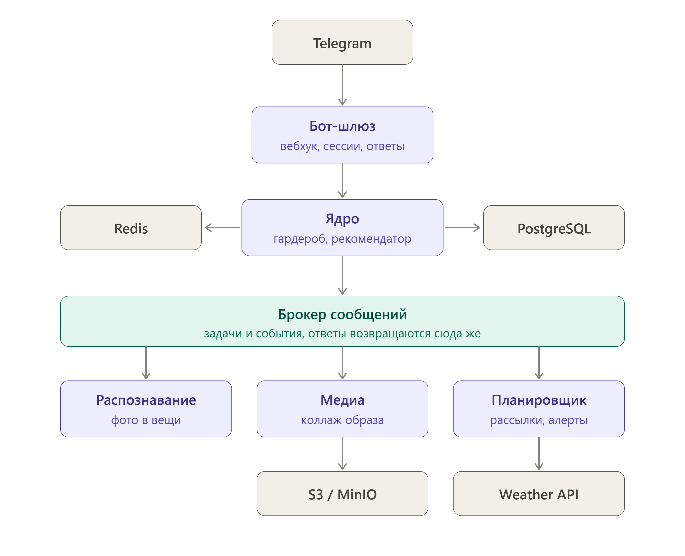

# Daily-stylist

Телеграм-бот, который ежедневно будет присылать рекомендацию одежды на основе вашего гардероба и погоды.

Статус: в разработке, MVP ещё не собран.

---

## Возможности

**MVP (сейчас делается)**

- **Онбординг.** Пока гардероб пуст, бот бесполезен, поэтому первым делом - быстрый ввод базового набора вещей.
- **Гардероб.** Вещи добавляются, редактируются и удаляются вручную. У каждой вещи есть статус: доступна, в стирке, не сезон, потеряна.
- **Утренняя рекомендация.** Приходит в заданное пользователем время, с учётом его часового пояса.
- **Рекомендация по запросу.** По нажатию кнопки с возможностью уточнения желаемого образа.
- **Погода.** Берётся по геолокации; место можно задать и вручную.
- **Учёт погоды и гардероба в подборе.** Температура, осадки и ветер, частота ношения (стараемся не повторяться, глубина настраивается), сочетаемость цветов, аксессуары: зонт, очки, сумка.
- **Фидбек.** «Нравится», «не нравится», «надел не это» - иначе частота ношения считается неверно, ведь рекомендация не равна факту ношения.
- **Много пользователей.** У каждого свой гардероб и свои настройки, чужие вещи недоступны.

**Планируется**

- распознавание одежды на фотографии: модель предлагает кандидатов, человек подтверждает;
- коллаж из фотографий вещей - увидеть образ целиком;
- советы по стилю и подсказки, что докупить в гардероб;
- уведомления о резкой смене погоды с предложением переодеться.

---

## Стек

| Часть | Технология |
|---|---|
| Бот, бизнес-логика, работа с базой | Go |
| Хранилище | PostgreSQL |
| Состояние диалогов, кэш погоды | Redis |
| Распознавание одежды и коллаж | Python + FastAPI, отдельный сервис |

Сервис работы с картинками появится позже: у него другой профиль ресурсов и свой темп обновления, поэтому он вынесен из основного процесса.

---

## Структура

```
backend/                  # Go: бот, логика, база
├── cmd/                  # точки входа - по одной на процесс
│   ├── bot/              #   слушает Telegram
│   └── scheduler/        #   утренняя рассылка по расписанию
├── internal/
│   ├── config/           # настройки из переменных окружения
│   ├── domain/           # сущности и правила подбора одежды
│   ├── service/          # сценарии приложения и объявления портов
│   ├── adapter/          # реализации портов: postgres, погода, vision
│   └── telegram/         # всё, что видит пользователь: хендлеры, кнопки, тексты
└── migrations/           # SQL-миграции

vision/                   # Python: распознавание и коллаж (позже)
contracts/                # OpenAPI-договор между Go и Python
deploy/                   # docker-compose: postgres, redis, бот, планировщик, vision
docs/                     # решения по архитектуре и причины, по которым они приняты
```

Зависимости направлены внутрь: `domain` не знает ни о ком, `service` знает только о `domain`, а `adapter` и `telegram` знают о `service`, но не наоборот. Связывает всех точка входа в `cmd/bot`.

Тесты лежат рядом с кодом, который проверяют; отдельной папки для них нет.

---

## Предполагаемая архитектура на выходе



На схеме предполагаемая конечная архитектура. В MVP из этой картины есть только бот-шлюз вместе с ядром в одном Go-процессе, планировщик рядом вторым процессом, PostgreSQL и Redis. Распознавание и коллаж приходят позже и сначала вызываются синхронно по HTTP, без брокера.

Брокер появится, когда синхронное ожидание станет мешать: распознавание фото и сборка коллажа занимают секунды и не должны блокировать ответы бота, а рассылка и алерты о погоде выигрывают от ретраев. Хранилище S3 - когда фотографий станет больше, чем разумно держать рядом с сервисом.

---

## Разработка

Требуется Go 1.27+, PostgreSQL и Redis.
